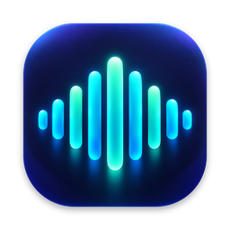

<p align="center">
  
</p>

# Voice

**Local speech-to-text for macOS. Hold fn, speak, release. Text appears wherever your cursor is.**

Voice is a menu bar app that replaces cloud-based dictation with fast, private, local transcription. It works everywhere -- terminals, browsers, editors, chat apps -- while keeping your audio and transcriptions on your Mac.

Built on [whisper.cpp](https://github.com/ggml-org/whisper.cpp) (Parakeet and Whisper speech models) and [llama.cpp](https://github.com/ggml-org/llama.cpp) (local AI cleanup), both compiled into the app. Voice is free and open source, with no accounts, usage limits, or telemetry. Audio and transcripts never leave your Mac. The only network requests are the one-time model downloads from Hugging Face and the "Check for Updates" menu item. Inspired by [Wispr Flow](https://wispr.com).

---

## Quick Start

```bash
git clone https://github.com/sho-luv/Voice.git
cd Voice
./install.sh
```

That's it. The installer builds and signs the app, installs it to `/Applications`, and sets it to start at login. On first launch Voice downloads its speech model (356 MB, plus 1.07 GB for AI cleanup if enabled). On first launch macOS will ask for two permissions -- grant both:

1. **Accessibility** -- needed to detect the hotkey and inject text
2. **Microphone** -- needed to record audio

## Usage

| Shortcut | Action |
|----------|--------|
| **Hold fn** | Push-to-talk. Records while held, transcribes on release. |
| **Double-tap fn** | Hands-free mode. Locks recording on for dictation. Tap fn again to stop. |
| **Escape** | Cancel the current recording. |

The push-to-talk key is configurable in Settings (fn, Right Option, Left Option, or Right Cmd).

A floating overlay at the top of the screen shows what's happening:

| Indicator | Meaning |
|-----------|---------|
| Pulsing red dot | Recording |
| Pulsing blue dot | Hands-free mode |
| Hourglass | Transcribing |
| Checkmark + text preview | Done |
| X + error message | Something went wrong |

The menu bar icon (a waveform) also reflects the current state. Click it for options including **Paste Last** to re-insert the most recent transcription, and to switch microphones.

### Transcription History

When transcript saving is enabled, each finished transcription is written to a local text file. The current app lets you:

- Full-text search across all transcriptions
- Copy any past transcription to clipboard
- Choose the save directory
- Turn transcript saving on or off

Browse this from **Settings... > Transcription**. By default files are stored in `~/Documents/Voice Transcripts`.

## Settings

Open from the menu bar (click the waveform icon > "Settings...") or press **Cmd+,**.

### General

| Setting | Description | Default |
|---------|-------------|---------|
| Push-to-talk key | fn, Right Option, Left Option, or Right Cmd | fn |
| Sounds | Audio feedback for recording start/stop/done | On |
| Auto-start on login | Install/remove LaunchAgent | On |
| Hands-free timeout | Safety auto-stop for hands-free mode (1-30 min) | 5 min |
| Restore clipboard after paste | Saves and restores clipboard when using Cmd+V paste | On |

### Audio

| Setting | Description | Default |
|---------|-------------|---------|
| Microphone | Input device, or the system default | System default |
| Show overlay | Floating recording overlay, with optional app name, app icon, and timer | On |
| Background, font size | Overlay appearance | 60%, medium |
| Waveform | How tall the overlay waveform bounces. Visual only; doesn't affect recording or transcription | 30x |

### AI

| Setting | Description | Default |
|---------|-------------|---------|
| Local AI text cleanup | Enable/disable AI post-processing of transcriptions | On |
| Custom instructions | Optional rewrite guardrails appended to the cleanup prompt | Blank |
| Custom vocabulary | Names, acronyms, and technical terms. Their spelling is restored in every transcript; the Whisper model also uses them to bias recognition | Blank |

### Transcription

| Setting | Description | Default |
|---------|-------------|---------|
| Model | Parakeet v3 (fastest) or Whisper large-v3-turbo (supports vocabulary biasing) | Parakeet v3 |
| Language | Automatic (detect) or a specific language — both models are multilingual | Automatic |
| Download Model | Download the selected model if not already on disk | -- |
| Save transcripts | Save each transcription to a local text file | On |
| Transcript directory | Folder used for saved transcript files | `~/Documents/Voice Transcripts` |

All settings persist across restarts via `UserDefaults` (`~/Library/Preferences/com.faradaysoft.voice.plist`).

## How Text Gets Inserted

Voice automatically picks the best method for the active app:

- **Most apps** (browsers, editors, chat) -- text is injected directly via the macOS Accessibility API. Instant, no clipboard involvement.
- **Terminal apps** (iTerm2, Terminal, Alacritty, WezTerm, Kitty, Warp, Hyper) -- uses clipboard paste with simulated Cmd+V. Your original clipboard is saved beforehand and restored 500 ms later (turn this off in Settings > General).

This happens automatically. No configuration needed.

## AI Text Cleanup

Voice can clean up raw transcription before inserting it:

- Strips filler words (um, uh, like, you know, basically)
- Fixes grammar and punctuation
- Handles corrections ("scratch that", "no wait" -- keeps only the final version)
- Knows which app you're dictating into

Hesitations ("um", "uh") are always removed deterministically. The local LLM (`Qwen2.5-1.5B-Instruct Q4_0`, run in-process by llama.cpp) only runs when a transcript needs judgment — ambiguous fillers, self-corrections, repeated words — and its output is discarded if it stops being a faithful rewrite (e.g. the model answers the text instead of cleaning it). Clean dictation is pasted without touching the model.

## How It Works

Speech recognition and cleanup run **in-process**: whisper.cpp (Whisper + NVIDIA Parakeet) and llama.cpp are compiled from pinned sources into one static library (`engine/`) sharing a single ggml with Metal acceleration. Models load when you start talking, stay warm while you use Voice, and are released after 10 idle minutes.

Models are downloaded on first launch into `~/Library/Application Support/Voice/Models/` and verified against pinned SHA-256 hashes before use:

| Model | Purpose | Size |
|-------|---------|------|
| Parakeet TDT 0.6B v3 Q4_0 | Speech recognition (default) | 356 MB |
| Whisper large-v3-turbo Q5_0 | Speech recognition (optional) | 574 MB |
| Qwen2.5-1.5B-Instruct Q4_0 | AI cleanup (if enabled) | 1.07 GB |

See [MODELS.md](MODELS.md) for benchmarks and the model selection history.

## Requirements

- macOS 13+ on Apple Silicon
- To build: Xcode Command Line Tools (`xcode-select --install`), [Homebrew](https://brew.sh), and `cmake`

The installer installs `cmake` if needed, builds the engine, and installs the app. The app downloads its models on first launch.

## Command-Line Companion

`install.sh` also links `voice.sh` to `~/bin/voice`, a terminal tool that records until you press Enter (or `voice -s` to stop after 3 seconds of silence), transcribes locally, and copies the text to the clipboard. It uses Homebrew's `whisper-cli` and `sox` (installed for you) and the Whisper turbo model, so select **Whisper turbo** in Settings > Transcription and download it once. It does not run AI cleanup.

## Release Docs

See [RELEASING.md](RELEASING.md) for the signed, notarized release pipeline.

## Manual Build

If you prefer to build without the installer:

```bash
brew install cmake

# Build the static speech engine (first run clones pinned whisper.cpp/llama.cpp, ~1 min),
# compile the app, and assemble Voice.app
./build-app.sh

# Sign (see Code Signing section below)
codesign --force --sign - --options runtime --entitlements Voice.entitlements Voice.app

# Run
open Voice.app
```

To check the engine without the UI, run the headless self-test. It loads the installed models, transcribes the given WAV files (16 kHz mono PCM), and runs the AI cleanup test battery:

```bash
./Voice.app/Contents/MacOS/Voice --selftest recording.wav
```

## Code Signing & Accessibility Permissions

macOS tracks Accessibility permissions by the app's code signature. With **ad-hoc signing** (`codesign --sign -`), the identity is tied to the binary hash -- so every recompile invalidates the permission and you must re-grant it.

To avoid this, create a local self-signed certificate:

```bash
# Generate certificate
openssl req -x509 -newkey rsa:2048 \
    -keyout /tmp/vc_key.pem -out /tmp/vc_cert.pem \
    -days 3650 -nodes -subj "/CN=Voice Dev" \
    -addext "keyUsage=digitalSignature" \
    -addext "extendedKeyUsage=codeSigning"

# Bundle and import to keychain
openssl pkcs12 -export -out /tmp/vc.p12 \
    -inkey /tmp/vc_key.pem -in /tmp/vc_cert.pem \
    -passout pass:temp123 -legacy
security import /tmp/vc.p12 -k ~/Library/Keychains/login.keychain-db \
    -P "temp123" -T /usr/bin/codesign

# Trust for code signing
security add-trusted-cert -d -r trustRoot -p codeSign \
    -k ~/Library/Keychains/login.keychain-db /tmp/vc_cert.pem

# Clean up
rm /tmp/vc_key.pem /tmp/vc_cert.pem /tmp/vc.p12

# Verify
security find-identity -v -p codesigning
# Should show: "Voice Dev"
```

Once created, `install.sh` automatically uses it. Accessibility permission survives recompiles.

**Re-granting Accessibility permission** (when needed):

1. Quit Voice (`pkill -f Voice.app`)
2. System Settings > Privacy & Security > Accessibility
3. Remove Voice if listed, then click **+** and add `Voice.app`
4. Toggle ON and authenticate
5. Launch Voice: `open Voice.app`

The app must **not be running** when you grant the permission.

## Troubleshooting

**fn key does nothing**
- Check System Settings > Privacy & Security > Accessibility -- Voice must be listed and enabled
- If you recompiled, you likely need to re-grant Accessibility (see above). If you set up the "Voice Dev" certificate, this is a one-time step
- If another app uses fn as a hotkey (e.g., Wispr Flow), close it or reassign the key
- Try a different push-to-talk key in Settings

**Text doesn't appear in my app**
- For terminals: Voice uses clipboard Cmd+V. If paste is disabled in your terminal settings, enable it
- For other apps: the Accessibility API is used. Make sure the app has an active text field focused

**AI cleanup not working**
- Confirm `~/Library/Application Support/Voice/Models/qwen2.5-1.5b-instruct-q4_0.gguf` exists; toggling AI cleanup off and on in Settings re-downloads it
- Clean dictation intentionally skips the model — only transcripts with fillers or corrections are sent to it
- Run `Voice --selftest` (see Manual Build) to see the model's output and whether the guardrail accepted it

## Uninstall

```bash
pkill -f Voice.app
rm -rf /Applications/Voice.app
rm ~/Library/LaunchAgents/com.faradaysoft.voice.plist
rm -f ~/bin/voice
# Optionally remove downloaded models:
rm -rf ~/Library/Application\ Support/Voice/Models
# Optionally remove settings:
defaults delete com.faradaysoft.voice
```

## License

Voice is free software: you can redistribute it and/or modify it under the terms of the [GNU General Public License](LICENSE) as published by the Free Software Foundation, either version 3 of the License, or (at your option) any later version.

Copyright © 2026 Enfrosec LLC (dba Faraday Soft).

Third-party components and model licenses are listed in [THIRD_PARTY_NOTICES.md](THIRD_PARTY_NOTICES.md).
